# Execution Plan

## Detailed Analysis Summary

### Change Impact Assessment
- **User-facing changes**: Yes — 고객용 주문 앱, 관리자용 대시보드 신규 구축
- **Structural changes**: Yes — 전체 시스템 아키텍처 신규 설계 (Spring Boot + React x2 + PostgreSQL)
- **Data model changes**: Yes — 매장, 테이블, 메뉴, 주문, 세션 등 전체 데이터 모델 신규
- **API changes**: Yes — REST API + SSE 전체 신규 설계
- **NFR impact**: Yes — JWT 인증, SSE 실시간 통신, Security Extension 전체 적용

### Risk Assessment
- **Risk Level**: Medium (신규 프로젝트이므로 기존 시스템 영향 없음, 다만 복잡도 높음)
- **Rollback Complexity**: Easy (Greenfield)
- **Testing Complexity**: Complex (다수 기능, 실시간 통신, AI 연동)

## Workflow Visualization

```mermaid
flowchart TD
    Start(["User Request"])
    
    subgraph INCEPTION["INCEPTION PHASE"]
        WD["Workspace Detection<br/>COMPLETED"]
        RA["Requirements Analysis<br/>COMPLETED"]
        US["User Stories<br/>COMPLETED"]
        WP["Workflow Planning<br/>COMPLETED"]
        AD["Application Design<br/>EXECUTE"]
        UG["Units Generation<br/>EXECUTE"]
    end
    
    subgraph CONSTRUCTION["CONSTRUCTION PHASE"]
        FD["Functional Design<br/>EXECUTE"]
        NFRA["NFR Requirements<br/>EXECUTE"]
        NFRD["NFR Design<br/>EXECUTE"]
        ID["Infrastructure Design<br/>EXECUTE"]
        CG["Code Generation<br/>EXECUTE"]
        BT["Build and Test<br/>EXECUTE"]
    end
    
    Start --> WD
    WD --> RA
    RA --> US
    US --> WP
    WP --> AD
    AD --> UG
    UG --> FD
    FD --> NFRA
    NFRA --> NFRD
    NFRD --> ID
    ID --> CG
    CG --> BT
    BT --> End(["Complete"])
    
    style WD fill:#4CAF50,stroke:#1B5E20,stroke-width:3px,color:#fff
    style RA fill:#4CAF50,stroke:#1B5E20,stroke-width:3px,color:#fff
    style US fill:#4CAF50,stroke:#1B5E20,stroke-width:3px,color:#fff
    style WP fill:#4CAF50,stroke:#1B5E20,stroke-width:3px,color:#fff
    style AD fill:#FFA726,stroke:#E65100,stroke-width:3px,stroke-dasharray: 5 5,color:#000
    style UG fill:#FFA726,stroke:#E65100,stroke-width:3px,stroke-dasharray: 5 5,color:#000
    style FD fill:#FFA726,stroke:#E65100,stroke-width:3px,stroke-dasharray: 5 5,color:#000
    style NFRA fill:#FFA726,stroke:#E65100,stroke-width:3px,stroke-dasharray: 5 5,color:#000
    style NFRD fill:#FFA726,stroke:#E65100,stroke-width:3px,stroke-dasharray: 5 5,color:#000
    style ID fill:#FFA726,stroke:#E65100,stroke-width:3px,stroke-dasharray: 5 5,color:#000
    style CG fill:#4CAF50,stroke:#1B5E20,stroke-width:3px,color:#fff
    style BT fill:#4CAF50,stroke:#1B5E20,stroke-width:3px,color:#fff
    style INCEPTION fill:#BBDEFB,stroke:#1565C0,stroke-width:3px,color:#000
    style CONSTRUCTION fill:#C8E6C9,stroke:#2E7D32,stroke-width:3px,color:#000
    style Start fill:#CE93D8,stroke:#6A1B9A,stroke-width:3px,color:#000
    style End fill:#CE93D8,stroke:#6A1B9A,stroke-width:3px,color:#000
    linkStyle default stroke:#333,stroke-width:2px
```



### Text Alternative
```
Phase 1: INCEPTION
- Workspace Detection (COMPLETED)
- Requirements Analysis (COMPLETED)
- User Stories (COMPLETED)
- Workflow Planning (COMPLETED)
- Application Design (EXECUTE)
- Units Generation (EXECUTE)

Phase 2: CONSTRUCTION (per-unit)
- Functional Design (EXECUTE)
- NFR Requirements (EXECUTE)
- NFR Design (EXECUTE)
- Infrastructure Design (EXECUTE)
- Code Generation (EXECUTE)
- Build and Test (EXECUTE)
```

## Phases to Execute

### INCEPTION PHASE
- [x] Workspace Detection (COMPLETED)
- [x] Requirements Analysis (COMPLETED)
- [x] User Stories (COMPLETED)
- [x] Workflow Planning (IN PROGRESS)
- [ ] Application Design - EXECUTE
  - **Rationale**: 신규 시스템으로 컴포넌트 식별, 서비스 레이어 설계, 컴포넌트 간 의존성 정의 필요
- [ ] Units Generation - EXECUTE
  - **Rationale**: 복잡한 시스템(백엔드 + 프론트엔드 2개 + DB + AI 연동)으로 다수 작업 단위 분해 필요

### CONSTRUCTION PHASE (per-unit)
- [ ] Functional Design - EXECUTE
  - **Rationale**: 데이터 모델, 비즈니스 로직(주문 상태 관리, 세션 관리, 결제 완료 처리) 상세 설계 필요
- [ ] NFR Requirements - EXECUTE
  - **Rationale**: Security Extension 전체 적용, JWT 인증, SSE 실시간 통신, 성능 요구사항 존재
- [ ] NFR Design - EXECUTE
  - **Rationale**: NFR Requirements에서 도출된 패턴을 설계에 반영 필요
- [ ] Infrastructure Design - EXECUTE
  - **Rationale**: Docker Compose 기반 배포 아키텍처, 컨테이너 구성 설계 필요
- [ ] Code Generation - EXECUTE (ALWAYS)
  - **Rationale**: 전체 코드 구현
- [ ] Build and Test - EXECUTE (ALWAYS)
  - **Rationale**: 빌드 및 테스트 지침 생성

### Skipped Stages
- Reverse Engineering - SKIP (Greenfield 프로젝트)

## Success Criteria
- **Primary Goal**: 단일 매장용 테이블오더 MVP 시스템 구축
- **Key Deliverables**: Spring Boot 백엔드, React 고객앱, React 관리자앱, PostgreSQL 스키마, Docker Compose 설정
- **Quality Gates**: Security Extension 전체 준수, INVEST 기준 스토리 충족, 단위 테스트 포함
